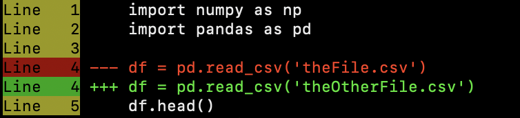

# Diff Checker

This project contains a Python script to check differences between files.

## Installation

To make the `diff-checker` available system-wide, run the installation script:

```bash
./install.sh
```

This will install the tool as `diffChecker`.

## Usage

After installation, you can use the tool like this:

```bash
diffChecker file1.txt file2.txt
```

